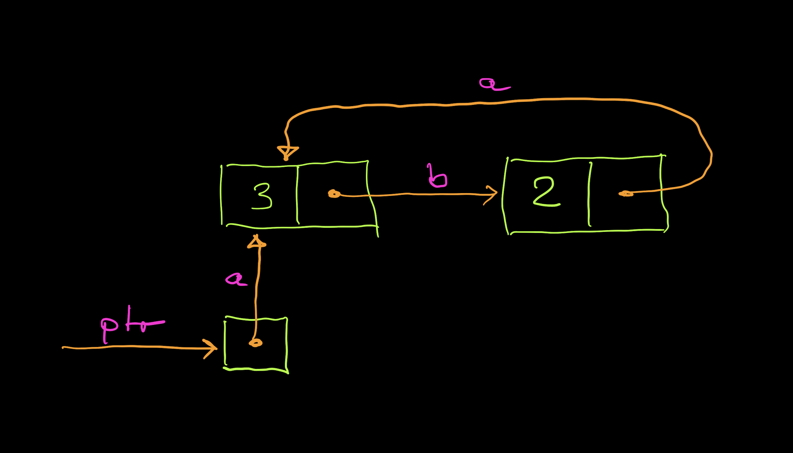
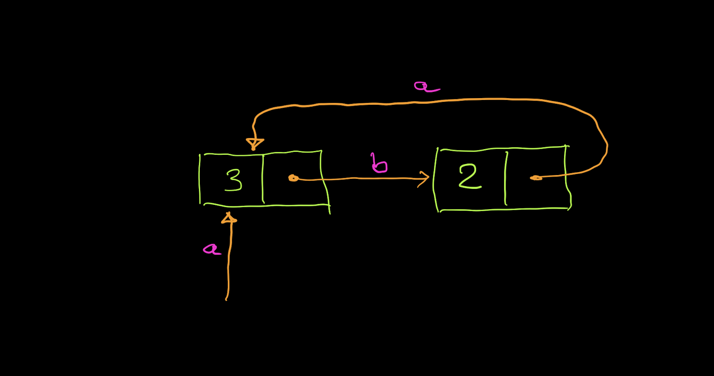

# The Memory Model

We will look at the memory model. The memory is divided in an immutable stack [^immutable-stack] and a mutable heap. To see the difference, run [^prompt]

    λ val a = new [] ;;

which creates a new name `a` on the stack and a new memory cell (or address) on the heap. To see this run

    λ :env

upon which we get to see a full list of the stack and the heap. I only show part of the overall output.

    a = <address 0>
    0 -> un-initialized
    
This tells us that `a` is a name for `address 0` (on the stack) and that the memory at address `0` has not been initialised (on the heap). 

**Remark:** The 'stack' and the 'heap' here are the "virtual" ones of LambdaFun (implemented in Haskell) and so are more abstract than the actual memory of your computer. Thus, keep in mind that we work here with a memory *model*. While this memory model is inspired by familiar imperative programming languages (C, Java, Pyton, etc), it has some notable differences, as we will explore now. 

Our first experiment gives a familiar result.

    λ a:=3;;
    λ :env

    a = <address 0>
    0 -> 3

This tells us that, after the assignment, address `a` (which is `0`) has content `3`. 

**Remark:** While ` = ` and ` -> ` can both be read as "the name on the left refers to the value on the right" we choose a different notation and language:
- We read `a = <address 0>` as "the *value* of `a` is address `0`", or, shorter, "`a` is address `0`".
- We read `0 -> 3` as "address `0` stores content `3`" or "the *content* of address `0` is `3`". 

The reason for this distinction is that `a` (on the left of `=`) is immutable, but address `0` (on the left of `->`) has content that can be changed via assignment. In fact, only the content of addresses can be changed, everything else is immutable, even if it looks as if it was on the 'heap'.

For example, we can change not `a` but its content as follows.

    λ a:=4;;

To verify that this has the expected result we inspect stack and heap:

    λ :env

    a = <address 0>
    0 -> 4

We see that `a = <address 0>` did not change ("`a` is still address `0`")  while `0 -> 3` became `0 -> 4` ("the content of `a` changed from `3` to `4`").

So far, we have seen the familiar behaviour of a variable `a` updated by assignment. The first indication that something is different comes from the following.

    λ a;;

    <address 0>
 
As an answer to the question `λ a;;` ("What is `a`?") we do not get `3`. We get `<address 0>` ("`a` is address `0`"). To obtain the value of `a` we need to ask the question `λ !a;;` ("What is the content of `a`?"):

    λ !a;;

    4

Differently to more familiar programming languages, we decided to make the distinction between "the address of a variable" and "the content of a variable" explicit. 

The next experiment highlights the difference between a name that is an integer (or some other value) and a name that is an address. Let us create a name `b` that represents the value `5`:

    λ val b = 5;;     
    λ :env

    a = <address 0>
    b = 5
    0 -> 4

**Exercise:** Explain what happens after

    λ b:=a;;

On the other hand, the following works as expected:

    λ a:=b;;
    λ :env

    a = <address 0>
    b = 5
    0 -> 5

Now `a`, which is address `0`, has content `5`.

To summarize what we have so far, we read `a:=b` as "change the content of `a` to `b`".

What may be unexpected is the following.

    λ val c = new [];;     
    λ c:= 7;;
    λ a:= c;;

Pause for a moment and ponder that there are two ways to answer the question `λ :env` now.  

    a = <address 0>
    0 -> ???

Do we want to replace `???` by the content of `c`, which is `7`, or by the address of `c`, which is `1`?

In fact, the console will choose the second answer: 

    a = <address 0>
    c = <address 1>
    0 -> <address 1>
    1 -> 7

To summarize, after `c:=7;a:=c` we have that `a` (which is address `0`) contains the address of `c`, which contains `7`.

What do we have to do, if we want `a` to contain the content of `c`? 

Recall that we can write `!c` to express "the content of `c`". And, indeed, 

    λ a:= !c;;

gives us

    a = <address 0>
    c = <address 1>
    0 -> 7
    1 -> 7

**Remark:** The names `a` and `c` are on the stack. Their values did not change through the examples. The stack is immutable. On the other hand, the addresses themselves are on the heap and their contents were changed using assignment `:=`.

**Remark:** If `a` is an address, we agreed to read `!a` as "the content of `a`", and `a` itself as "the address of `a`". In the examples of linked lists, we will see that we can also think of `!` as dereferencing a pointer, or following an indirection. 

- ***Apart from variables on the stack being immutable, the biggest difference wrt a programming language such as C is that in LambdaFun the meaning of a variable*** `a` ***does not depend on whether*** `a` ***appears to the left of an assignment as in*** `a:=` ***or to the right of an assignment as in*** `:=a`. 
- In LambdaFun, in both cases, `a` must be read as the "address of `a`". 
- If we want to assign the content of `a` we need to write `:=!a`.

**Summary:** We encountered three new functions, which we can think of as having types as indicated:

    new :: () -> addr
    (:=) :: addr -> value -> ()
    ! :: addr -> value

`new` allocates a new address on the heap. `:=` is an infix operator that takes an address and a value and changes the memory by assigning the value to the address. `!` takes an address and returns its value.

**Exercise:** Run through the following, at each step predicting the result and then inspecting the environment.

    λ val a = new [];;
    λ a := [1,"NULL"];;
    λ val b = new [];;
    λ b := [2,a];;
    λ a := [3,b];;
    
Inspect the environment with `:env`

    a = <address 0>
    b = <address 1>
    0 -> [3, <address 1>]
    1 -> [2, <address 0>]

and explain in which sense the above defines a cyclic list.

**Exercise** (optional): Make a cyclic list of length 3.

**Exercise:** Continue from the exercise above as follows.

    λ val ptr = new [];;
    λ ptr := a;;

This creates a pointer `ptr` that points to `a`. A pointer has as its content an address. The content of `ptr` is (the address of) `a`:

    λ !ptr == a;;
    true

Verify that 

    λ case !(!ptr) of { [e,x] -> ptr := x };;
    
moves the pointer `ptr` one element along the cyclic list, from `a` to `b`. 

What happens if you execute `case !(!ptr) of { [e,x] -> ptr := x };;` again? And again? 

(See also the function `length` in [linked-list.lc](test/linked-list.lc).) 

**Remark:** After the previous exercise, the environment contains

    a = <address 0>
    b = <address 1>
    ptr = <address 2>
    0 -> [3, <address 1>]
    1 -> [2, <address 0>]
    2 -> <address 0>

where in the last line the content of address `2` depends on whether `ptr` points to address `0` (which is `a`) or whether it points to address `1` (which is `b`). Notice that `ptr` is different from `a` and `b` in that not only `ptr` is an address, but also `!ptr` contains an address. So while we have to write `!a` to access the content of `a`, we have to write `!(!ptr)` to access the data represented by `ptr`.

It is important to practice to translate the output of `:env` more abstract pictures of the heap: 

.

**Exercise** (optional): Continuing from the above, express `case !(!ptr) of { [e,x] -> ptr := x }` with the help of `head` and `tail` without using `case` or `:=`.

**Remark:** The function `length` works by moving a pointer along the list. In our setting this means that the pointer must be mutable, hence on the heap. For the `next` function, which only takes "one step to the right", we do not need pointers. In other words, we can simplify the relevant picture to

.

**Exercise:** Write a function `next` that satisfies the following.

    λ next a == b;;
    true  
    λ next b == a;;
    true

    λ next a;;
    <address 1>
    λ next b;;
    <address 0>

[^prompt]: λ is the prompt of the REPL, what follows is our input. Lines that do not start with λ are output of the console. Btw, since the source code of `LamFun` is available, if there are features you do not like, you can change them. (But not for any assignment.)

[^immutable-stack]: The stack is mutable at the top level. This can be seen by 

        λ val i = 0;;
        λ i;;
        λ val i = i+1;;
        λ i;;

    but this does not work inside a function.